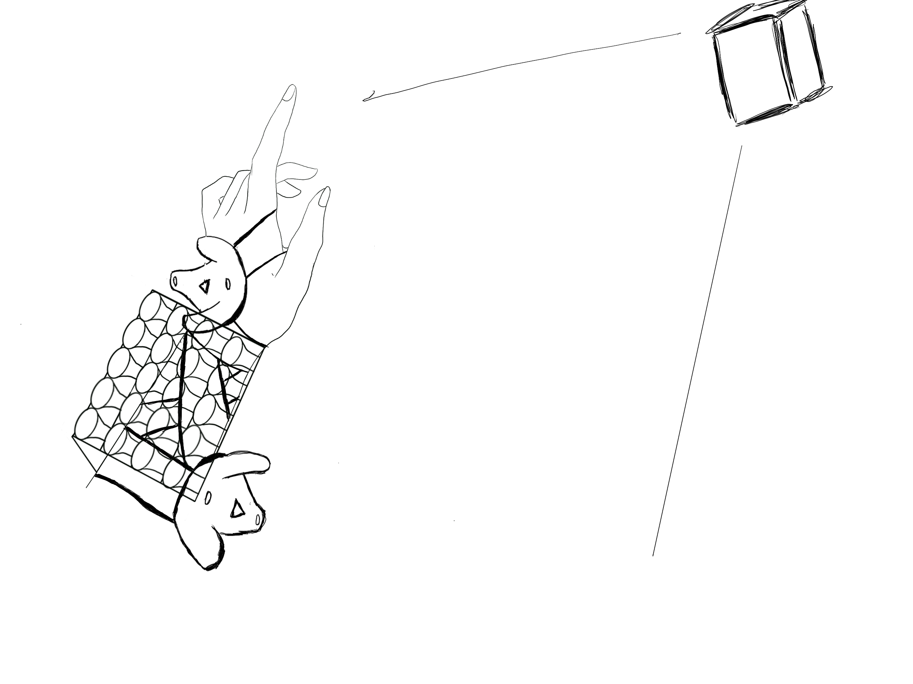

# Feedback From last class

1. Define the precise spatial tracking methodology
    - Time will be a major topic to consider if we want (IMU + SLAM)
    - **defining your core interaction model and consider whether the added complexity serves your fundamental creative goals.**
        - I will say that interactive with spatial audio & compose will become one of the major goal to achive with. I looking at the **PANMAN** from NIME paper and [Magic Joystick](https://www.platane.us/index.php/en/products/daw-controller/js?format=html),
        the target I want to reach is that let the body movement be one of the interative part not only pan using switch.

    
2. Access and test MiMu Glove technology 
    - I had email to Michell Hope I can get before the class start

# Vision 2 - Week 3 Sep 16

We discuss about using anothor method using VIVE tracker.
So now concept will be this:

- Location tracking method ---> VIVE Tracker
- Perform Pad/ MIDI board -----> lumatone like keyboard

___ 

Below is the V2 idea graph.

# Weekly Progress Toward Milestones (aiming for 6/6)

### Decisions & Scope

Dropped MiMu Glove; standardized on VIVE Tracker for spatial pose.

Kept the core interaction: body movement = compositional parameters (not just left/right panning). References: PANMAN and Magic Joystick; my focus is “playable mappings,” not complexity.
___

VIVE Tracker → SteamVR/OpenVR → OSC → Max/MSP or Max for Live → spatial/timbre parameters

Lumatone-like grid for harmony/clip triggers/mode switches.

4) Reflection / Documentation (aiming for 2/2)

# Short reflection

Removing the glove reduces integration overhead and lets me focus on audible, playable mappings. Speed→granular density creates a clear textural change, but jitter requires EMA smoothing and a dead-zone to avoid chattering. Orientation→distance/reverb feels musical when the reverb ratio moves slower than pan—this keeps localization stable while space “breathes.” The key challenge is maintaining predictability so gestures feel like technique, not randomness. Next week’s 60-second demo will validate: (1) clarity of each mapping, (2) intuitiveness of gestures, (3) robustness when moving around the stage.
